# Labour Management Tool

Portfolio project for managing employees, shifts, holidays, skills and reporting, built as part of a Full Stack Software Development Diploma.

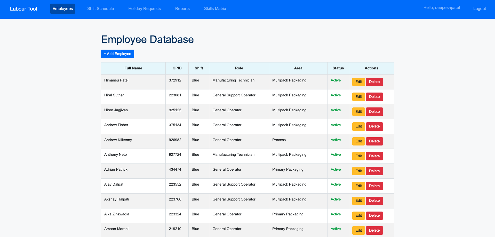
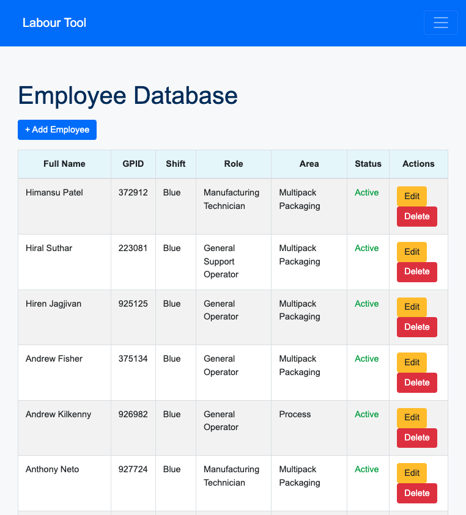
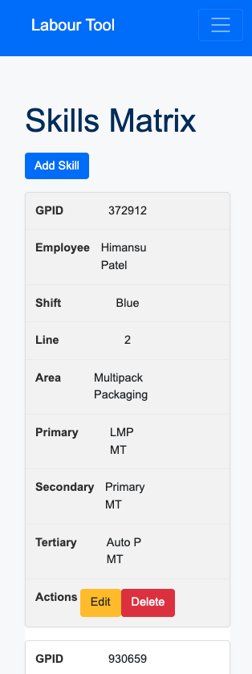

---

## Live Demo

🔗 [Live Deployed Project](https://labour-tool-45111572f062.herokuapp.com)

---

## Site Objectives
Design and create a labour management tool to demonstrate an increasing understanding of the libraries, frameworks, and deployment solutions available to developers.

My three main objectives were:

### Build a clean and responsive user interface
I wanted managers to navigate easily between employees, shifts, skills, and holidays. Django templates and Bootstrap 5 were used for styling and layout.

### Leverage available backend functionality
The backend framework enables secure authentication, full CRUD operations for employees, skills, and holiday requests, and lays the groundwork for future shift scheduling and reporting features. Django’s ORM, django-allauth, and django-crispy-forms power these workflows.

### Store data on external cloud services
I integrated PostgreSQL from Code Institute database to manage employee data, skillsets and store Holiday data.

## User Experience / UX

**Target Audience**  
- Managers and team leads responsible for staff oversight.
- HR administrators tracking skills, holidays, and resource available.  
- Small business owners seeking a simple way to view and manage employee data.

**User Stories**

### New Visitor Goals
- **Understand core functionality**  
  Quickly see that the tool lets them view employees, their roles, skills and holiday status.  
- **Learn how to get started**  
  Find the login process, as this contains sensitive data, this would be tailor made for each business.
- **Explore navigation**  
  Discover where to click to view Employees, Skills, Holidays and (future) Shift Scheduling & Reports.

### Existing Visitor Goals
- **Log in and out securely**  
  Enter their credentials and access the firms dashboard.  
- **View employee directory**  
  Browse all staff members, see their roles, assigned shifts and areas of work.  
- **Check skills inventory**  
  Search or filter employees by skill to find the right person for the job.  
- **Monitor holiday requests**  
  See pending, approved and upcoming time-off grouped by area of work.  
- **(Future) Manage shifts & generate reports**  
  Assign or adjust shifts and pull utilization reports once those features are released.

## Design Choices

### Colour Scheme
- **Backgrounds**: Light gray (#f8f9fa) for a neutral, low-fatigue backdrop  
- **Text**: Dark gray (#212529) for high readability  
- **Primary Accent**: Bright blue (#0d6efd) on buttons and links to draw attention  
- **Status Indicators**:  
  - Success – green (#198754)  
  - Warning – orange (#fd7e14)  
  - Error – red (#dc3545)  

This neutral palette keeps the interface clean and consistent, with accents guiding the user toward interactive elements.

### Typography
- **Base font**: `font-family: Arial, sans-serif;`  
  A widely supported, easy-to-read system font that ensures consistency across devices.  
- **Hierarchy**:  
  - Headings use larger weights of Arial for clear section separation  
  - Body text remains standard weight for optimal legibility  

### Logo
- **Favicon**: 🧑‍💼 (Office worker emoji)  
  Chosen as a simple, universally recognizable icon to represent staff management and the core purpose of the tool.

## Wireframes

### Desktop Login wireframe

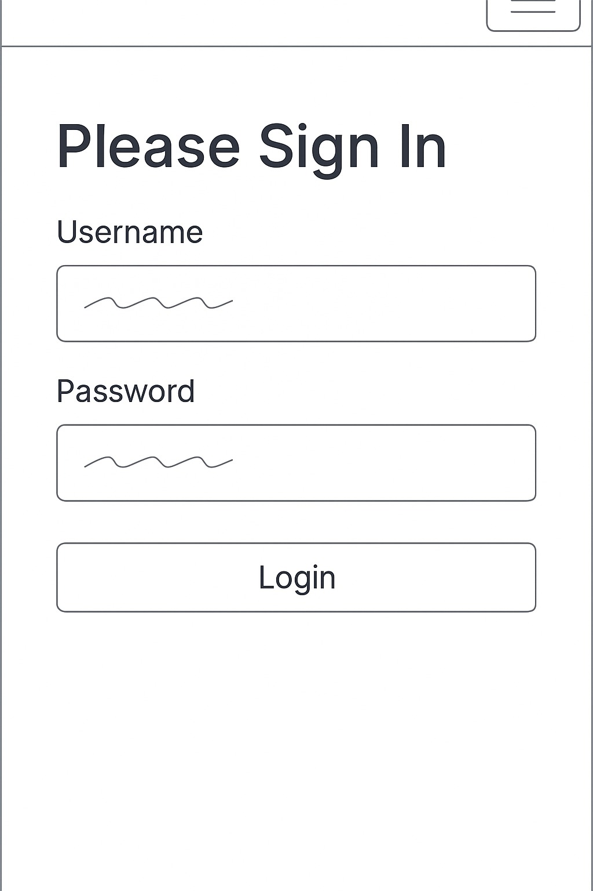

### Mobile Employee App Homepage wireframe

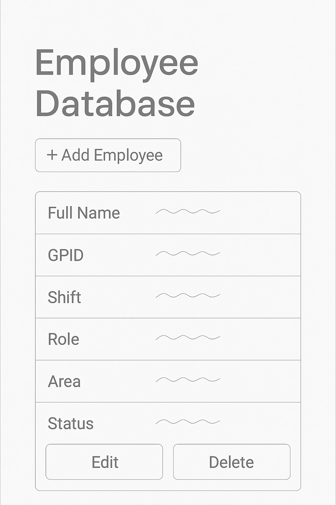

### Mobile Skills App Homepage wireframe

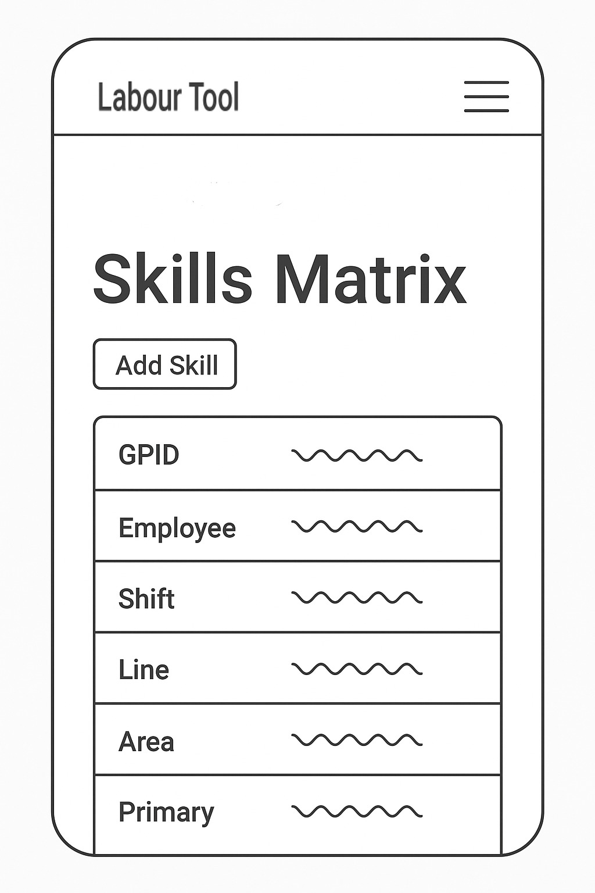

### Mobile Holiday App Homepage wireframe

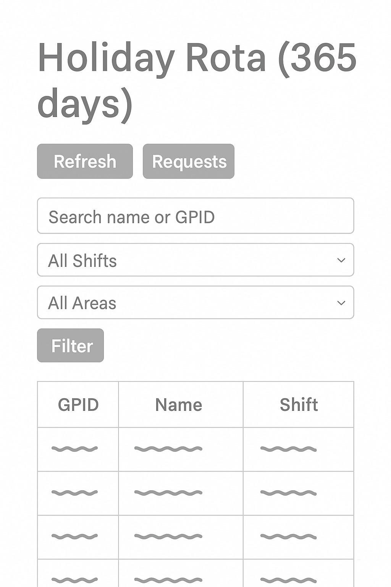

### Tablet Login wireframe


### Tablet Employee App Homepage wireframe

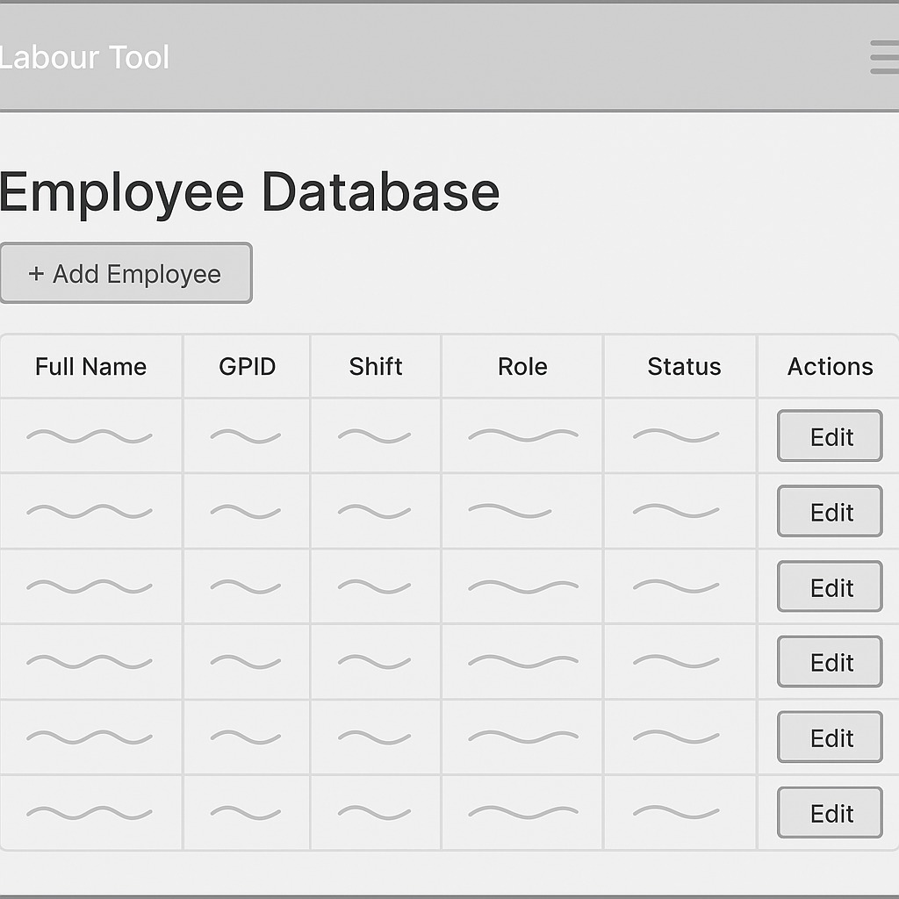

### Tablet Skills App Homepage wireframe

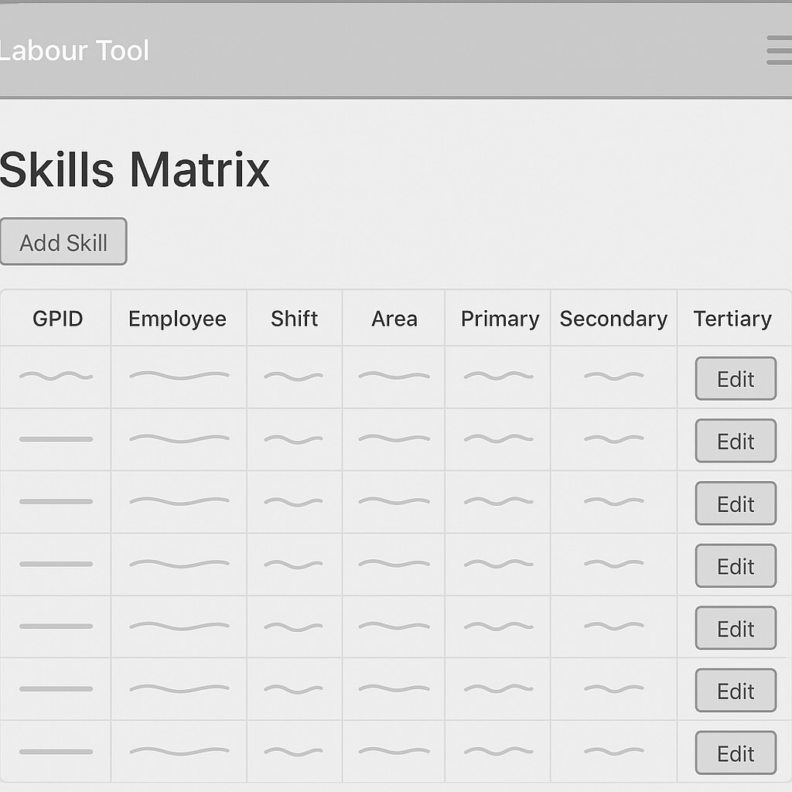

### Tablet Holiday App Homepage wireframe

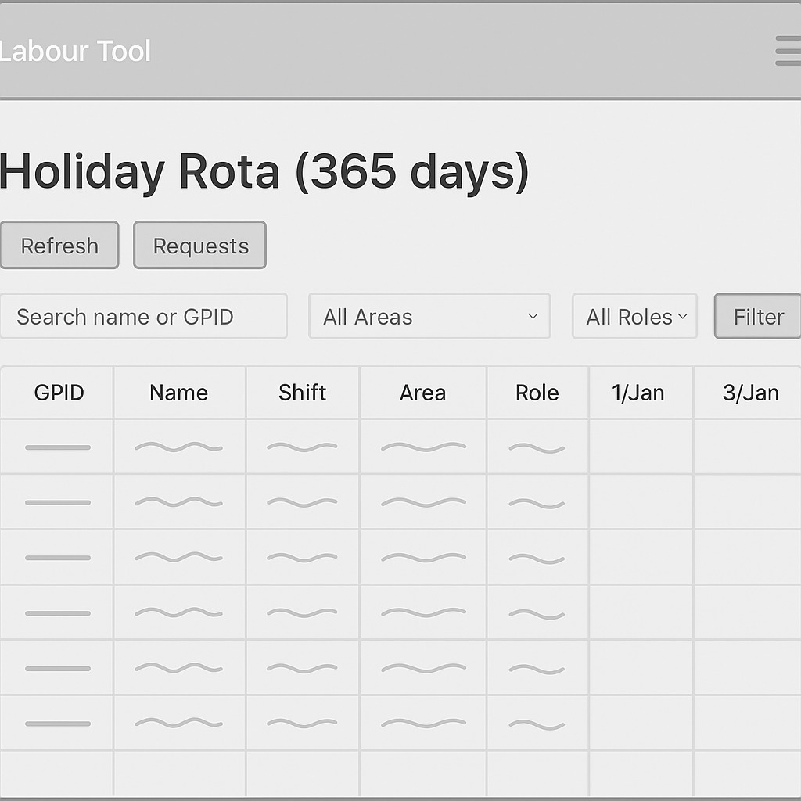

### Desktop Login wireframe

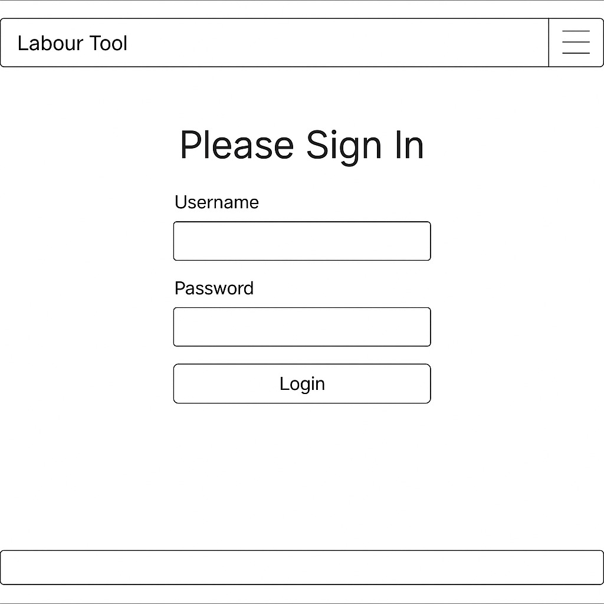

### Desktop Employee App Homepage wireframe

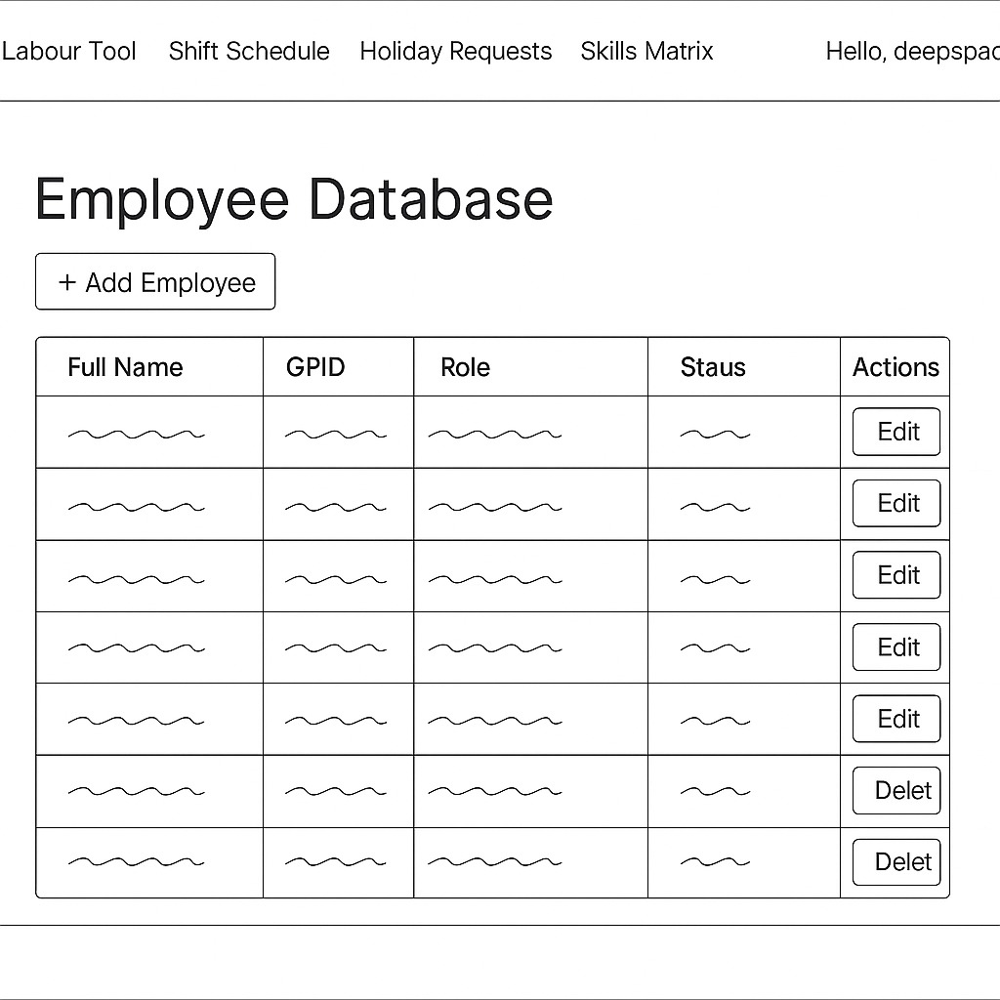

### Desktop Skills App Homepage wireframe


### Desktop Holiday App Homepage wireframe

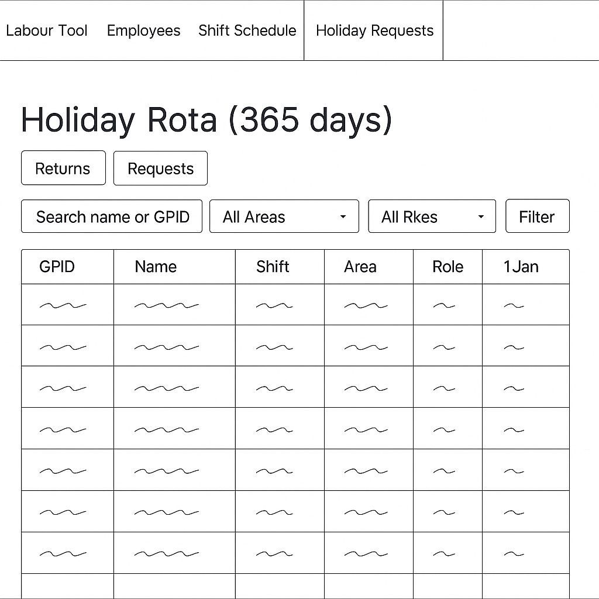


## Database Plan

Below is an outline of the main tables, their columns, data types, constraints, and relationships based on your `models.py` definitions.

### `employees_employee`
| Column      | Type                | Constraints                                                      |
|-------------|---------------------|------------------------------------------------------------------|
| `id`        | `AutoField`         | Primary key                                                     |
| `full_name` | `VARCHAR(100)`      | Unique, NOT NULL                                                |
| `gpid`      | `VARCHAR(20)`       | Unique, NOT NULL                                                |
| `shift`     | `VARCHAR(10)`       | Choices: Green, Blue, Red, Yellow; Default: Green               |
| `role`      | `VARCHAR(3)`        | Choices: GSO, GO, MT, ST; Default: GSO; NOT NULL                |
| `line`      | `VARCHAR(10)`       | Choices: 1, 2, 3, 4, MOH, ALL; Default: 1; NOT NULL            |
| `area_id`   | `INTEGER`           | FK → `skills_area(id)`, on_delete=PROTECT; NOT NULL             |
| `active`    | `BOOLEAN`           | Default: True                                                   |

> **Relationships:**  
> - Many **Employee** rows relate to one **Area** row (`area_id` FK).

---

### `skills_area`
| Column | Type           | Constraints           |
|--------|----------------|-----------------------|
| `id`   | `AutoField`    | Primary key           |
| `name` | `VARCHAR(100)` | Unique, NOT NULL      |

---

### `skills_skillmaster`
| Column | Type           | Constraints           |
|--------|----------------|-----------------------|
| `id`   | `AutoField`    | Primary key           |
| `name` | `VARCHAR(100)` | Unique, NOT NULL      |

---

### `skills_employeeskill`
| Column             | Type       | Constraints                                                                    |
|--------------------|------------|--------------------------------------------------------------------------------|
| `id`               | `AutoField`| Primary key                                                                    |
| `employee_id`      | `INTEGER`  | OneToOne FK → `employees_employee(id)`, on_delete=CASCADE; NOT NULL            |
| `primary_skill_id` | `INTEGER`  | FK → `skills_skillmaster(id)`, on_delete=PROTECT; NOT NULL                    |
| `secondary_skill_id` | `INTEGER`| FK → `skills_skillmaster(id)`, on_delete=PROTECT; NULLABLE                    |
| `tertiary_skill_id`  | `INTEGER`| FK → `skills_skillmaster(id)`, on_delete=PROTECT; NULLABLE                    |

> **Relationships:**  
> - Each **EmployeeSkill** row is a 1–1 profile for an **Employee**.  
> - Skills in **SkillMaster** can appear as primary, secondary, or tertiary in many profiles.

---

### `holidays_holidayrequest`
| Column        | Type              | Constraints                                                           |
|---------------|-------------------|-----------------------------------------------------------------------|
| `id`          | `AutoField`       | Primary key                                                          |
| `employee_id` | `INTEGER`         | FK → `employees_employee(id)`, on_delete=CASCADE; NOT NULL          |
| `start_date`  | `DATE`            | NOT NULL                                                             |
| `end_date`    | `DATE`            | NOT NULL                                                             |
| `status`      | `VARCHAR(10)`     | Choices: Pending, Approved, Rejected; Default: Pending; NOT NULL     |
| `requested_at`| `DATETIME`        | auto_now_add=True                                                    |
| `reviewed_at` | `DATETIME`        | NULLABLE                                                             |

> **Relationships:**  
> - Each **HolidayRequest** belongs to one **Employee**.

---


## Features

### Authentication
Only users that have been given strict access are able to log on to this webpage. This is due to it containing confidential information.

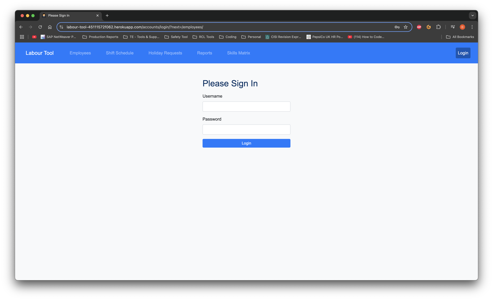

### Landing Page


### Employment Management
Perform full CRUD on employee records:
- **Create** new profiles with name, GPID, role, line and area  
- **Read** the employee directory, filterable by role or line  
- **Update** details such as active status or role  
- **Delete** profiles when staff leave  

### Skills Matrix
Maintain and assign skill sets for each employee:
- Define master skills  
- Attach primary, secondary, tertiary skills to an employee  
- Search/filter employees by skill  

### Holiday Page
Managers can submit time-off requests on behalf of employees; managers can then approve or reject based of discretion:
- View list of pending, approved, and rejected requests  
- See requests grouped by area of work  

### Future Features

- **Shift Scheduling** – drag-and-drop roster management with AI features to auto assign.
- **Reporting** – exportable CSV/PDF summaries of utilisation, skills coverage, holidays  
- **Role-Based Permissions** – more granular access controls for HR vs. line managers  

## Features Not Included

- **Bulk Import/Export** of employee data  
- **Email Notifications** for request status changes  
- **Mobile-First Layout** (responsive design is basic for now as the use will predomminatly be on desktop)

## Technologies Used

Here are the tools and services used to build and deploy this project:

- **GitHub**: code hosting and version control.
- **Heroku**: platform for deploying the application via a `Procfile`.
- **PostgreSQL from Code Institute**: external PostgreSQL database hosting (configured via `DATABASE_URL`).
- **sqlparse**: used for formatting SQL queries and migrations.  

### Programming Languages, Frameworks and Libraries

- **Python 3**  
- **Django 4.2.7**  
- **django-allauth** for authentication  
- **django-crispy-forms**, **crispy-bootstrap5**, **django-widget-tweaks**, **django-summernote** for form rendering and rich-text editing
- **Bootstrap 5**, **HTML5**, **CSS3**, **JavaScript**  
- **dj-database-url**, **psycopg2-binary** for database configuration & PostgreSQL driver
- **Gunicorn**, **WhiteNoise** for the WSGI server and static file serving
- **PyJWT**, **oauthlib**, **requests-oauthlib**, **python3-openid** for OAuth and JWT support  
- **asgiref**, **urllib3** as core dependencies

## Agile

This project was designed using Agile methodology, utilising the Project Board and Issues sections in GitHub. [GitHub Project Board](https://github.com/users/Deepeshpatel11/projects/15)


## Testing

All tests were performed from the **Manager** perspective, using desktop, tablet, and mobile browsers. Any issues were fixed before moving on to the next feature.

### Manual Testing (Manager)

| TEST                                              | OUTCOME                                                               | PASS/FAIL |
|---------------------------------------------------|-----------------------------------------------------------------------|-----------|
| Manager Login                                     | Successfully authenticated and redirected to Dashboard               | Pass      |
| View Employee Directory                           | Employee list displays names, roles, shifts, lines, and areas        | Pass      |
| Create Employee                                   | New employee created and appears correctly in the directory          | Pass      |
| Edit Employee                                     | Employee details (role, line, area, active status) updated           | Pass      |
| Delete Employee                                   | Employee removed and no longer listed                                 | Pass      |
| Page Navigation: Employee → Skills                | Clicking “Skills” on an employee loads that employee’s skill profile  | Pass      |
| Data Flow: Employee → Skills                      | Primary/secondary/tertiary skills saved for the selected employee     | Pass      |
| Define Skill Master Entry                         | New skill added to master list                                        | Pass      |
| Assign Skills to Employee                         | Primary/secondary/tertiary skills correctly saved                     | Pass      |
| Edit Employee Skill Profile                       | Updated skill assignments saved                                       | Pass      |
| Delete Employee Skill Profile                     | Employee skill profile removed                                        | Pass      |
| Page Navigation: Employee → Holidays              | Clicking “Holidays” on an employee loads that employee’s holiday list  | Pass      |
| Data Flow: Employee → Holidays                    | All holiday requests for the selected employee display correctly      | Pass      |
| View Holiday Requests                             | Pending, Approved, and Rejected requests display by area              | Pass      |
| Approve Holiday Request                           | Status changes to “Approved” and moves to the approved list           | Pass      |
| Decline Holiday Request                           | Status changes to “Rejected” and moves to the rejected list           | Pass      |
| _(Future)_ Configure Shifts                       | Placeholder—feature in planning stage                                 | N/A       |
| _(Future)_ Generate Reports                       | Placeholder—feature in planning stage                                 | N/A       |

### Bugs & Fixes

1. **Holiday Date Validation**  
   - Issue: Requests where end date precedes start date were accepted without error.  
   - Fix: Added server-side validation to ensure `end_date >= start_date`.

2. **Duplicate GPID Constraint**  
   - Issue: Integrity error when creating an employee with an existing GPID.  
   - Fix: Client-side form check and user-friendly error message on duplicate GPIDs.

3. **Style Overrides**  
   - Issue: Custom CSS was overridden by Bootstrap defaults after layout changes.  
   - Fix: Scoped override rules and increased specificity to preserve custom styles.

4. **Employee Names**  
   - Issue: Long or hyphenated employee names overflowed the table layout and caused misalignment.  
   - Fix: Added CSS (`word-wrap: break-word; max-width: 200px;`) to table cells to contain names neatly.

5. **Heroku Static Files**  
   - Issue: CSS assets were not served on Heroku, resulting in a broken layout.  
   - Fix: Configured WhiteNoise in `settings.py` and ran `python manage.py collectstatic` during deployment.

6. **Environment Variables & Allowed Hosts**  
   - Issue: `DEBUG=False` without proper `ALLOWED_HOSTS` configuration caused 500 errors in production.  
   - Fix: Set `DEBUG=False` and specified `ALLOWED_HOSTS=['your-app.herokuapp.com']` (or `['*']` for testing) in `settings.py`.

7. **Database Configuration on Deployment**  
   - Issue: Heroku’s `DATABASE_URL` was not parsed correctly, leading to connection failures.  
   - Fix: Integrated `dj_database_url.config()` in `settings.py` to parse and apply the `DATABASE_URL` automatically.  


## Lighthouse
I have tested each of the pages bar the page for Shift Schedule and Reports due to them being placeholders for future development.

### Mobile & Desktop results for Home page:
Mobile
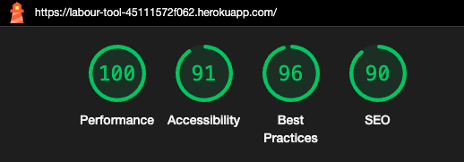

Desktop
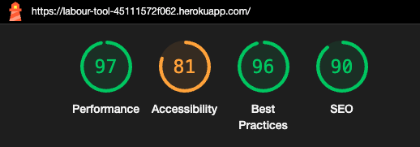

### Mobile & Desktop results for Employee page:
Mobile
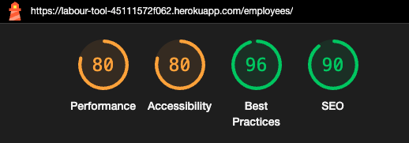

Desktop
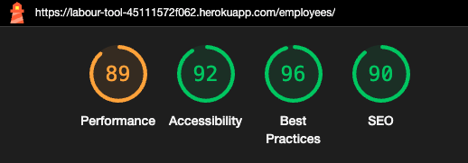

### Mobile & Desktop results for Skills page:
Mobile
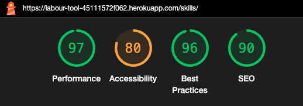

Desktop
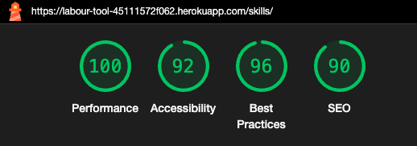

### Mobile & Desktop results for Holidays page:
Mobile
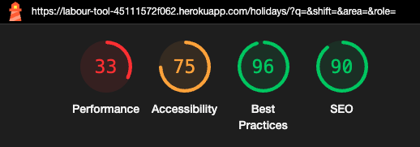

Desktop
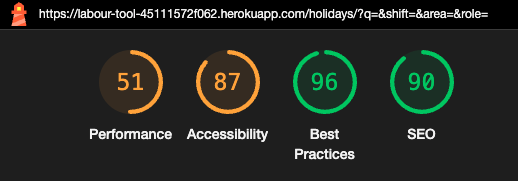


The performance is low on the pages where there is massive amounts of data, such as holidays page this due to annual leave planner accounting for the full year, whereas in the employees page, there is c.400 data entries so far.


## Validation Testing

### HTML & CSS

The following shows HTML validations - No errors found.

- Homepage
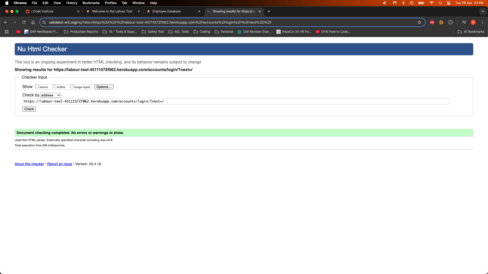

- Employees Page


- Shifts Page


- Holidays Page
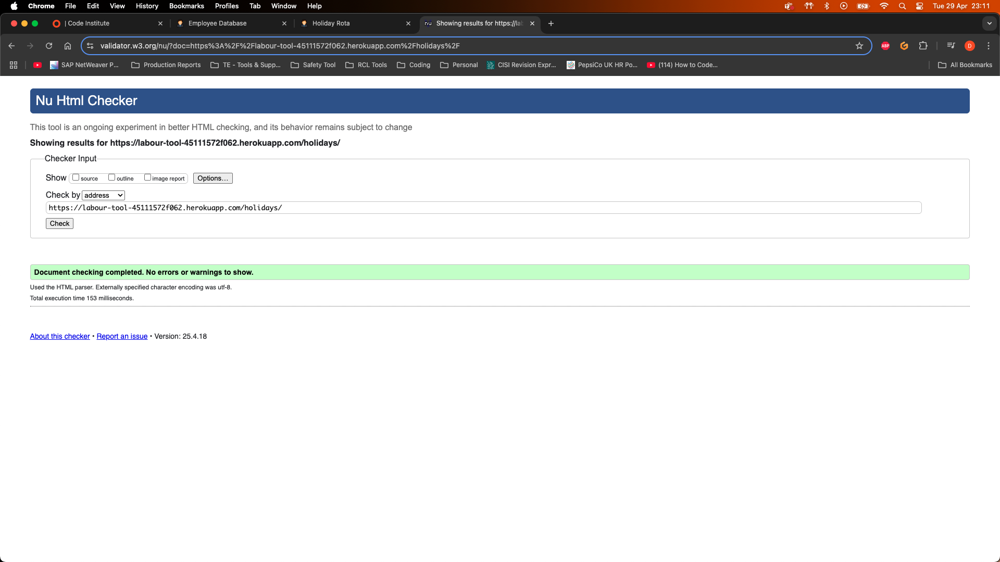

- Reports Page
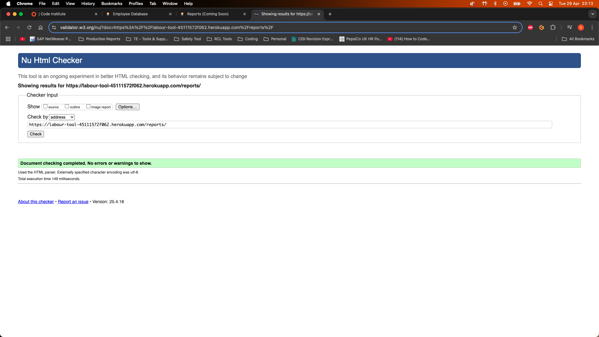

- Skills Page
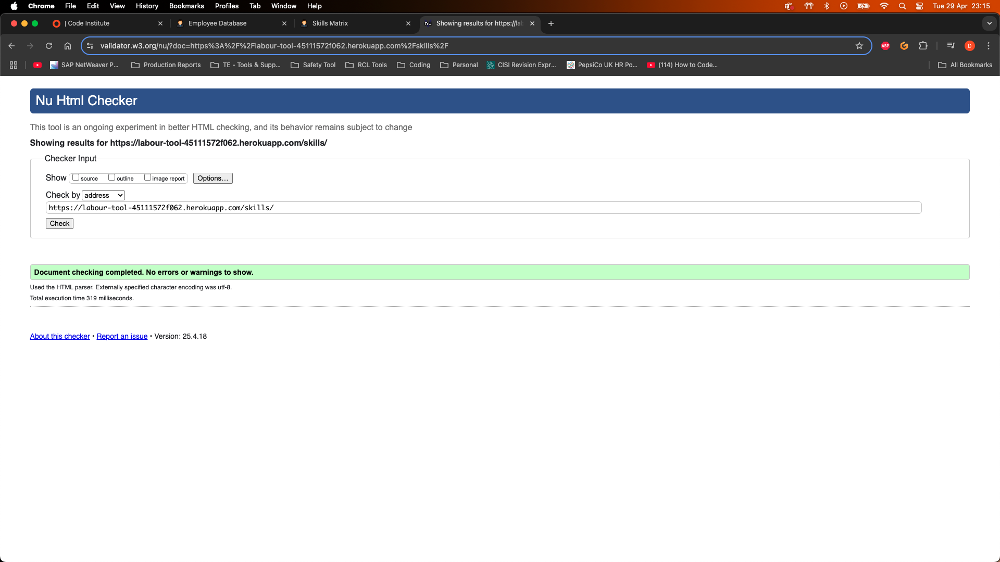

- Static CSS code
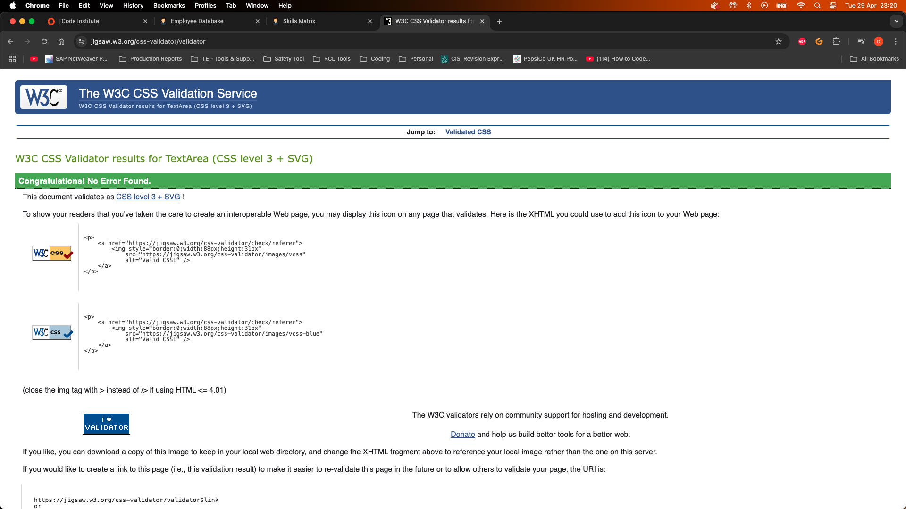


### Python Testing

Python pep8 validation was done via [Code Institute's Python Linter](https://pep8ci.herokuapp.com/)

The only errors recieved here were where some lines of text exceeded the limit of 79 characters, but these have now been rectified.

Python Files Tested:

- admin
- models
- forms
- views
- urls
- settings

## GitHub Deployment

The website’s source code is stored on GitHub for version control and collaboration. After each addition, change, or removal of code, run the following commands in your IDE’s terminal:

```bash
git add .
git commit -m "meaningful commit message"
git push
```

Your changes will be available in your GitHub repository at:
https://github.com/Deepeshpatel11/Labor-Tool


## Creating a Fork or Copy
```md
To fork or copy the repository:

1. Go to the repository page: https://github.com/Deepeshpatel11/Labor-Tool  
2. Click the **Fork** button in the top-right corner to create your own copy under your GitHub account.
```

## Cloning the Repository

To clone the repo to your local machine:

1. On the repo page, click the **Code** button (to the left of the Gitpod tab).  
2. Click the clipboard icon to copy the clone URL (`https://github.com/Deepeshpatel11/Labor-Tool.git`).  
3. Open your terminal (e.g., Git Bash) and navigate to your desired directory.  
4. Run:
   ```bash
   git clone https://github.com/Deepeshpatel11/Labor-Tool.git
   ```
5. Enter the cloned directory:
    ```bash
    cd Labor-Tool
    ```


## Repository Deployment via Heroku

```md
1. Log in to your [Heroku Dashboard](https://dashboard.heroku.com).  
2. Click **New** → **Create new app**.  
3. Enter an **App name**, choose a **Region**, then click **Create app**.  
4. Under the **Settings** tab, click **Reveal Config Vars** and add:
   - `SECRET_KEY` : `<your SECRET KEY>`
   - `DATABASE_URL` : `<your Postgres Database URL>`

5. Still in **Settings**, click **Add buildpack** and add, in this order:
   1. `heroku/python`
   2. `heroku/nodejs`
```

## Deploying the App on Heroku

1. Switch to the **Deploy** tab.  
2. Under **Deployment method**, select **GitHub**.  
3. Search for `Deepeshpatel11/Labor-Tool` and click **Connect**.  
4. Choose **Automatic deploys** (optional) to redeploy on every push, or **Manual deploy** to trigger builds yourself.  
5. Click **Deploy Branch** (or wait for automatic deploy).  
6. Once the build succeeds, click **Open app** to launch your live site.


## Credits

### Project Lead
- **Deepesh Patel** – concept, design, development, testing, documentation, and deployment.

### Mentor
- **Jubril** - Thank you for guiding me and helping me bring my vision to fruition.

### Hosting & Deployment
- **Version Control**: GitHub  
- **CI/CD & Runtime**: Heroku  
- **IDE & Containers**: Visual Studio Code  

### Acknowledgements
- **Django Documentation** – for comprehensive framework guidance  
- **Bootstrap Documentation** – for responsive UI patterns  
- **Code Institute** – Full Stack Software Development Diploma curriculum  
- **Open-Source Community** – maintainers of all third-party packages used  
- **Paigination** - I used this guide to have responsive paigination https://www.sitepoint.com/community/t/responsive-table-that-converts-to-card-layout/322248/2
- **Deployment** - A special shout out to Oisin, whom helped me debug my code.
- **Testing** - Thank You Shiv for testing out the functionality of the website on different devices.
- **Emotional Support** - Prachi Thank you for dealing with my querks whilst this projecgt consumed me and pushing me to achieve this goal!